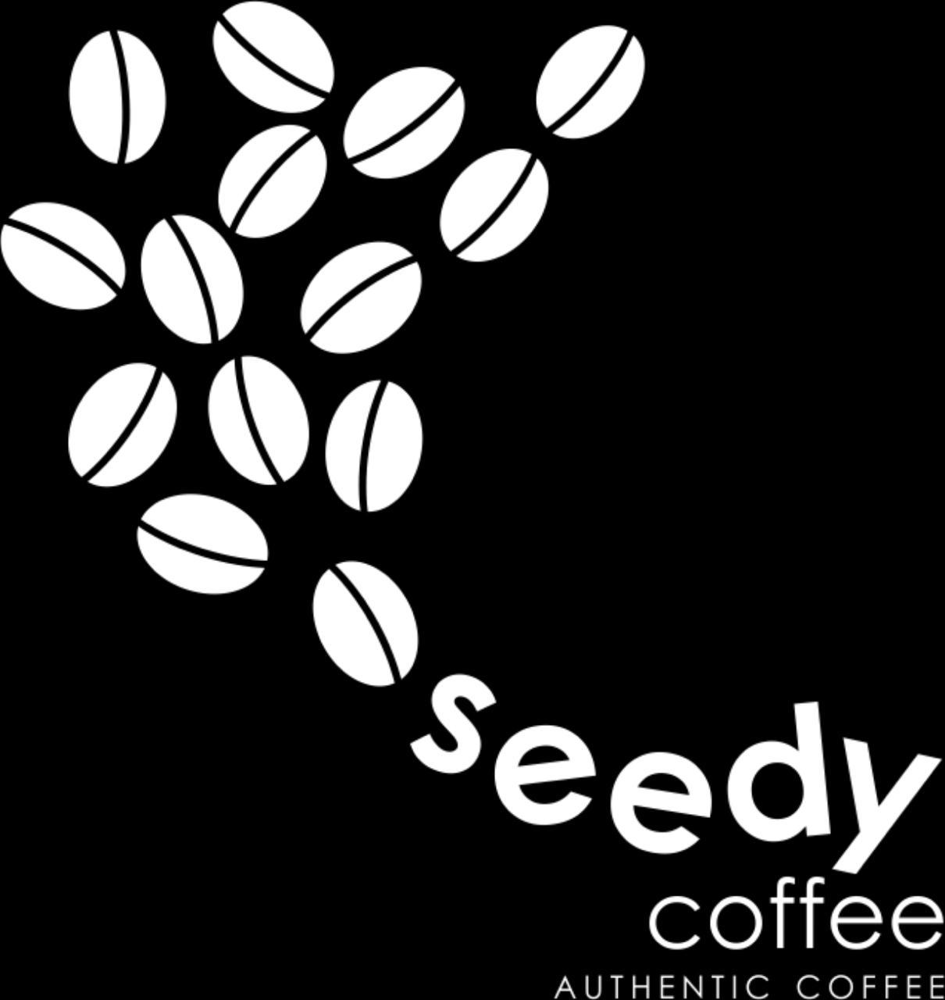

# ☕ SeedyOrder — Premium Coffee Shop App

<p align="center">
  
</p>

<p align="center">
  <b>Aplikasi pemesanan kopi berbasis mobile dengan sistem multi-role, pembayaran QR, dan AI dashboard.</b>
</p>

<p align="center">
  
  
  
  
</p>

---

## 📱 Deskripsi Aplikasi

**SeedyOrder** adalah aplikasi mobile pemesanan kopi yang dikembangkan sebagai Proyek Akhir mata kuliah Pemrograman Aplikasi Bergerak. Aplikasi ini dirancang untuk mensimulasikan sistem pemesanan coffee shop modern dengan tiga peran pengguna: **Customer**, **Admin**, dan **Kasir**.

Customer dapat menelusuri menu, melakukan pemesanan, dan membayar menggunakan kode unik atau QR code. Admin dapat mengelola menu, banner promo, dan memantau performa bisnis melalui dashboard AI berbasis Gemini. Kasir dapat memverifikasi dan mengkonfirmasi pembayaran secara real-time menggunakan input kode manual maupun scan QR.

---

## ✨ Fitur Aplikasi

### 👤 Customer
| Fitur | Keterangan |
|---|---|
| Registrasi & Login | Autentikasi dengan OTP email via Supabase |
| Browse Menu | Filter berdasarkan kategori dan pencarian |
| Customisasi Pesanan | Pilihan size, sugar level, dan ice/temp |
| Keranjang Belanja | Tambah, ubah jumlah, hapus item |
| Checkout & Pembayaran | Generate kode unik + QR code |
| Riwayat Pesanan | Lihat status pesanan dengan pull-to-refresh |
| Notifikasi | Update status pembayaran dan promo real-time |
| Edit Profil | Ubah nama, nomor HP, dan foto profil |

### 🔧 Admin
| Fitur | Keterangan |
|---|---|
| Manajemen Menu | CRUD menu dengan upload foto, label, dan toggle ketersediaan |
| Manajemen Banner | Upload banner promo dengan crop gambar 8:3 |
| Promo WhatsApp | Kirim pesan promo massal ke seluruh customer |
| Dashboard Analitik | Grafik pendapatan mingguan, top menu, statistik penjualan |
| AI Insight | Analisis bisnis otomatis menggunakan Google Gemini 2.5 Flash |
| Kelola Pesanan | Lihat dan filter semua pesanan dengan search |

### 🧾 Kasir
| Fitur | Keterangan |
|---|---|
| Input Kode Manual | Cari pesanan berdasarkan kode unik |
| QR Scanner | Scan QR code dari layar customer secara langsung |
| Konfirmasi Pembayaran | Verifikasi dan konfirmasi pembayaran 1 tap |
| History Transaksi | Riwayat semua transaksi dengan filter status |

---

## 🧩 Widget yang Digunakan

### Layout & Navigation
| Widget | Kegunaan |
|---|---|
| `Scaffold` | Struktur dasar setiap halaman |
| `CustomScrollView` + `SliverToBoxAdapter` | Scroll layout kompleks (home, detail menu) |
| `SliverGrid` | Grid menu di halaman utama |
| `SliverList` | List dinamis dalam scroll view |
| `TabBar` + `TabBarView` | Navigasi tab di Admin dan Kasir |
| `IndexedStack` | Bottom navigation tanpa rebuild |
| `BottomNavigationBar` (custom) | Navigasi utama 4 tab user |
| `PageView` | Banner slider di halaman utama |
| `Stack` + `Positioned` | Overlay pada gambar menu dan banner |
| `SafeArea` | Menghindari area notch/status bar |

### Input & Form
| Widget | Kegunaan |
|---|---|
| `TextField` / `TextFormField` | Input teks di seluruh form |
| `DropdownButtonFormField` | Pilihan kategori dan label menu |
| `Switch.adaptive` | Toggle ketersediaan menu dan customisasi |
| `FilteringTextInputFormatter` | Validasi input (blokir emoji, filter karakter) |
| `LengthLimitingTextInputFormatter` | Batas panjang input |
| `GestureDetector` | Tap handler pada berbagai elemen UI |

### Display & Visual
| Widget | Kegunaan |
|---|---|
| `Image.network` | Tampilkan gambar menu/banner dari URL |
| `Image.memory` | Preview gambar setelah crop |
| `ClipRRect` | Gambar dengan border radius |
| `CircleAvatar` | Foto profil user |
| `AnimatedContainer` | Animasi perubahan state (chip kategori, filter) |
| `FadeTransition` + `ScaleTransition` | Animasi splash screen dan form |
| `LinearProgressIndicator` | Password strength indicator |
| `CircularProgressIndicator` | Loading state |
| `SmoothPageIndicator` | Indikator halaman banner slider |
| `QrImageView` | Generate QR code pesanan |
| `BarChart` (fl_chart) | Grafik pendapatan mingguan |
| `MobileScanner` | Scanner QR code kamera real-time |

### Dialog & Overlay
| Widget | Kegunaan |
|---|---|
| `AlertDialog` / `Dialog` | Konfirmasi aksi (logout, hapus, checkout) |
| `ModalBottomSheet` | Edit profil user |
| `SnackBar` (custom `BrewSnackbar`) | Notifikasi feedback aksi |
| `showDialog` | Tampilkan dialog konfirmasi |

### Scroll & Refresh
| Widget | Kegunaan |
|---|---|
| `RefreshIndicator` | Pull-to-refresh riwayat pesanan |
| `ListView.separated` | Daftar pesanan dan menu admin |
| `SingleChildScrollView` | Scroll pada form panjang |
| `GridView` | Tampilan grid menu (via SliverGrid) |

### Custom Widgets (Reusable)
| Widget | Kegunaan |
|---|---|
| `BrewButton` | Tombol utama dengan 3 style (primary, outline, ghost) |
| `BrewTextField` | Text field dengan label dan validasi |
| `BrewSnackbar` | Snackbar custom dengan ikon |
| `MenuCard` | Kartu menu dengan sold-out overlay dan badge label |
| `OptionPill` | Pill selector untuk customisasi pesanan |
| `ImageCropScreen` | Layar crop gambar reusable |

---

## 🛠️ Tech Stack

| Teknologi | Kegunaan |
|---|---|
| **Flutter** | Framework utama (Android) |
| **Supabase** | Backend: Auth, Database, Storage, Realtime |
| **Google Gemini 2.5 Flash** | AI insight dashboard admin |
| **Provider** | State management |
| **mobile_scanner** | QR code scanner |
| **qr_flutter** | Generate QR code |
| **fl_chart** | Chart/grafik dashboard |
| **image_picker + crop_your_image** | Upload dan crop foto |
| **google_fonts** | Tipografi (Playfair Display + DM Sans) |

---

## 🚀 Cara Build

```bash
# Clone repo
git clone https://github.com/Rafanov/PA-PAB-SeedyCoffee.git
cd PA-PAB-SeedyCoffee

# Install dependencies
flutter pub get

# Salin dan isi file environment
cp .env.example .env
# Isi SUPABASE_URL, SUPABASE_ANON_KEY, GEMINI_API_KEY di .env

# Build APK (Android)
flutter build apk --dart-define-from-file=.env --release --split-per-abi
```

> **Catatan:** File `.env` tidak disertakan di repository karena mengandung credentials. Gunakan `.env.example` sebagai template.

---

## 👥 Tim Pengembang

Proyek Akhir — Pemrograman Aplikasi Bergerak

Raihan Fariz N - 2409116083

Indah Maramin Al Inayah - 2409116086

RIZKY YUNIA SURONO - 2409116089

Muhammad Romadhoni Alfatih - 2409116104

Muhamad Irpan Santoso - 2409116119

---

<p align="center">Made with ☕ and Flutter</p>
